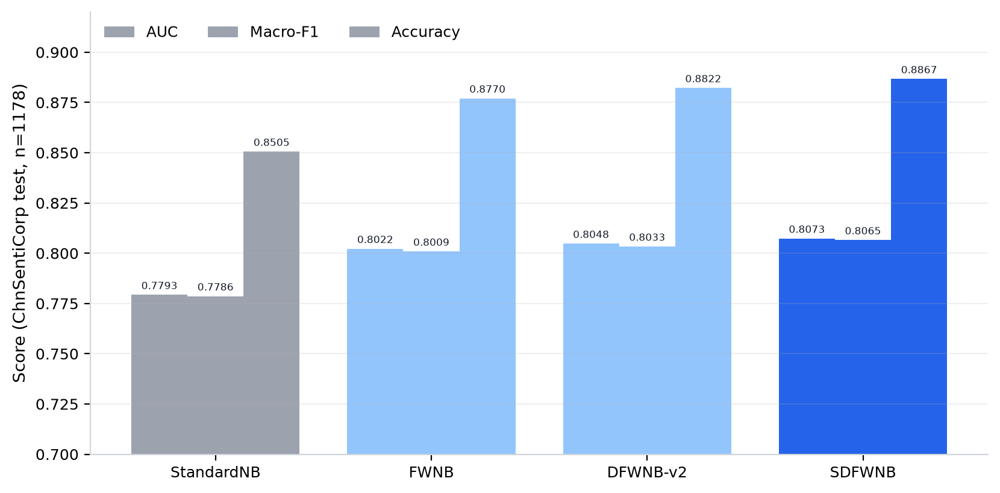
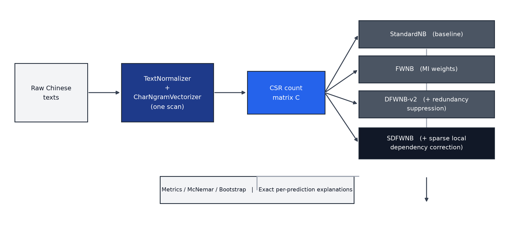
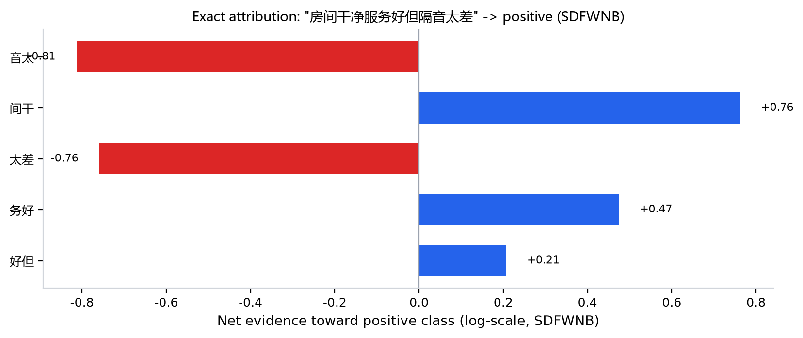

# HanBayes

Interpretable Bayesian models for Chinese sentiment classification.

[](https://github.com/GOOD-123-CPU/hanbayes/actions/workflows/ci.yml)
[](LICENSE)
[](pyproject.toml)
[](https://github.com/astral-sh/ruff)
[](src/hanbayes/py.typed)

HanBayes is a small, from-scratch Python package for studying and using a
family of Naive Bayes classifiers on Chinese sentiment data. It is built for
transparent experiments and reproducible baselines, not for claiming neural
state-of-the-art performance.

It focuses on three things:

- **Interpretability**: predictions decompose into exact feature evidence and
  local dependency effects.
- **Reproducibility**: the reported ChnSentiCorp final-test numbers are frozen
  in config and regenerated by one command.
- **Simplicity**: the implementation uses `numpy`, `scipy` and `pandas`, with
  no `sklearn` dependency.

中文简介见 [中文说明](#中文说明)。

<p align="center">
  
</p>

## What It Implements

HanBayes trains four related models over the same sparse character n-gram
matrix. The models are intentionally close to one another so each added
mechanism can be measured and explained:

| Model | Description |
|---|---|
| `StandardNB` | Multinomial Naive Bayes with Laplace smoothing. |
| `FWNB` | Feature-weighted NB using mutual-information weights. |
| `DFWNB-v2` | FWNB plus document-level redundancy suppression. |
| `SDFWNB` | DFWNB-v2 plus sparse local dependency correction for adjacent bigram pairs. |

The high-level `ChineseSentimentAnalyzer` fits the whole family in one call.
Internally, text is scanned once by `CharNgramVectorizer`; all models reuse the
same CSR count matrix.

<p align="center">
  
</p>

## Results

Final-test protocol:

- Dataset: ChnSentiCorp
- Training data: cleaned train + dev splits
- Evaluation data: cleaned test split, `n = 1178`
- Config: [configs/frozen.json](configs/frozen.json)

| Model | Accuracy | Macro-F1 | AUC |
|---|---:|---:|---:|
| `StandardNB` | 0.7793 | 0.7786 | 0.8505 |
| `FWNB` | 0.8022 | 0.8009 | 0.8770 |
| `DFWNB-v2` | 0.8048 | 0.8033 | 0.8822 |
| `SDFWNB` | **0.8073** | **0.8065** | **0.8867** |

`StandardNB -> SDFWNB` is significant under McNemar's exact test
(`15` vs `48` discordant pairs, `p = 0.000038`). The paired-bootstrap 95% CI
for the Macro-F1 gain is `[0.0153, 0.0409]`.

The checked-in result files are in [results/](results/):

- [final_test_metrics.csv](results/final_test_metrics.csv)
- [final_test_mcnemar.csv](results/final_test_mcnemar.csv)
- [final_test_bootstrap.csv](results/final_test_bootstrap.csv)
- [reproduction_log.txt](results/reproduction_log.txt)

## Installation

```bash
git clone https://github.com/GOOD-123-CPU/hanbayes.git
cd hanbayes
python -m pip install -e .
```

For development:

```bash
python -m pip install -e ".[dev,plot]"
```

Requirements:

- Python 3.9+
- `numpy`
- `pandas`
- `scipy`

## Reproduce the Reported Numbers

Download the dataset splits:

```bash
hanbayes download --data-dir data/raw
```

Run the final-test protocol:

```bash
hanbayes final-test --data-dir data/raw --out-dir results
```

To also save the fitted analyzer for later explanations:

```bash
hanbayes final-test --data-dir data/raw --out-dir results --save-model
```

Then explain raw text with the saved model:

```bash
hanbayes explain --model-path results/hanbayes_model.pkl --text "房间干净服务好"
```

## Python Usage

```python
from hanbayes import ChineseSentimentAnalyzer

analyzer = ChineseSentimentAnalyzer.from_config()
analyzer.fit(train_texts, train_labels)

report = analyzer.evaluate(dev_texts, dev_labels)
print(report.to_string())

labels = analyzer.predict(["房间干净服务好", "房间太差态度恶劣"])
probabilities = analyzer.predict_proba(["这家酒店性价比超高"])
```

Prediction explanations are exact decompositions of the same scores used for
classification:

```python
explanation = analyzer.explainer.explain_prediction(
    "房间干净服务好",
    model_name="SDFWNB",
    top_n=10,
)
```

You can also use the lower-level models directly:

```python
from hanbayes import StandardNB
from hanbayes.features import CharNgramVectorizer

vectorizer = CharNgramVectorizer(
    ngram_range=(2, 2),
    min_df=2,
    max_features=50000,
)
counts = vectorizer.fit_transform(train_texts)

model = StandardNB(alpha=0.05)
model.fit(counts, train_labels)
predictions = model.predict(counts)
```

See [docs/api.md](docs/api.md) for the public API.

<p align="center">
  
</p>

## Command Line

```bash
hanbayes --help
```

Available commands:

| Command | Purpose |
|---|---|
| `hanbayes download` | Download ChnSentiCorp TSV splits and verify SHA-256 checksums. |
| `hanbayes run` | Train on the cleaned train split and evaluate on the cleaned dev split. |
| `hanbayes final-test` | Merge cleaned train + dev, then evaluate once on the cleaned test split. |
| `hanbayes explain` | Emit JSON explanations for raw input texts using a saved analyzer. |
| `hanbayes info` | Print the frozen configuration. |

## Data Policy

This repository does **not** redistribute ChnSentiCorp. The downloader fetches
the TSV splits from the public `pengming617/chnsenticorp` GitHub mirror and
verifies their checksums.

| File | SHA-256 prefix |
|---|---|
| `train.tsv` | `b85b8318588fcf68` |
| `dev.tsv` | `1ecfbc62abe99b71` |
| `test.tsv` | `f47c7d28989b1de3` |

Manual placement is supported: put UTF-8 TSV files in `data/raw/` with
`label` and `text_a` columns, or a compatible two-column layout.

Do not train directly on the raw splits if you want to reproduce the reported
numbers. The pipeline applies a two-stage cleaning protocol that removes label
conflicts, duplicates and cross-split leakage before modeling.

## Repository Layout

```text
hanbayes/
├── configs/frozen.json          # frozen hyperparameters
├── src/hanbayes/                # package source
│   ├── analyzer.py              # high-level analyzer
│   ├── features.py              # character n-gram vectorizer
│   ├── models/core.py           # StandardNB / FWNB / DFWNB-v2 / SDFWNB
│   ├── interpretability/        # exact attribution engine
│   ├── pipeline.py              # reproduction pipeline
│   ├── evaluation.py            # metrics and significance tests
│   ├── data/                    # download, IO and cleaning
│   └── cli.py                   # command-line interface
├── docs/                        # algorithm and API notes
├── notebooks/demo.ipynb         # interactive walkthrough
├── results/                     # reproduced final-test tables
└── tests/                       # pytest suite
```

## Development

Install development tools and run the checks used by CI:

```bash
python -m pip install -e ".[dev,plot]"
python -m ruff check src/ tests/ scripts/
python -m pytest tests/ -q
python -m build
python -m twine check dist/*
```

The test suite covers normalization, deterministic vocabulary construction,
model degradation properties, cleaning behavior, persistence, CLI parsing and
explanation-score consistency.

GitHub Actions runs linting, tests on Python 3.9-3.13 across Linux/macOS/Windows,
and package build checks.

## Documentation

- [Algorithm notes](docs/algorithm.md)
- [API reference](docs/api.md)
- [Changelog](CHANGELOG.md)
- [Contributing guide](CONTRIBUTING.md)

## Citation

```bibtex
@misc{hanbayes2026,
  title  = {HanBayes: Interpretable Discriminatively-Weighted Naive Bayes with Sparse Dependency Correction for Chinese Sentiment},
  author = {HanBayes Contributors},
  year   = {2026},
  url    = {https://github.com/GOOD-123-CPU/hanbayes}
}
```

## License

HanBayes is released under the [MIT License](LICENSE). The ChnSentiCorp dataset
is governed by its own terms and is not included in this repository.

## 中文说明

HanBayes 是一个面向中文情感分类的可解释贝叶斯模型包。它从零实现四个模型：
`StandardNB`、`FWNB`、`DFWNB-v2` 和 `SDFWNB`，用于比较普通朴素贝叶斯、
互信息特征加权、冗余抑制和局部依赖修正带来的变化。

项目重点：

- 使用一次字符 n-gram 扫描生成稀疏矩阵，四个模型共享同一份特征计数。
- 每个预测都能精确拆解为先验、特征证据和依赖修正项，不依赖 LIME/SHAP 等近似解释。
- `hanbayes final-test` 可以复现仓库中保存的 ChnSentiCorp 最终测试结果。
- 仓库不包含原始数据集，只提供下载、校验和清洗流程。

快速开始：

```bash
python -m pip install -e .
hanbayes download --data-dir data/raw
hanbayes final-test --data-dir data/raw --out-dir results
```

Python 示例：

```python
from hanbayes import ChineseSentimentAnalyzer

analyzer = ChineseSentimentAnalyzer.from_config()
analyzer.fit(train_texts, train_labels)
print(analyzer.evaluate(dev_texts, dev_labels).to_string())
```

如果你要贡献代码，请先阅读 [CONTRIBUTING.md](CONTRIBUTING.md)，并确保测试和冻结复现结果保持通过。
